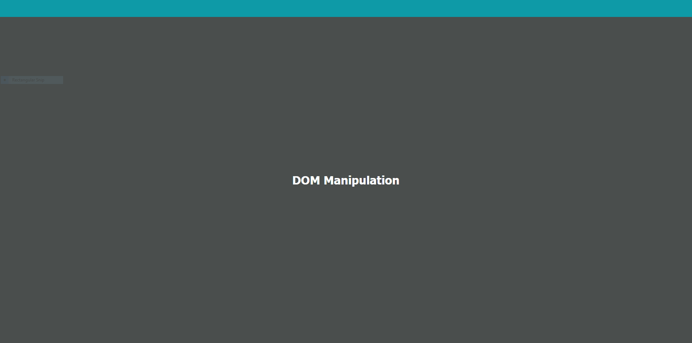

# ALAB 316.1.1

# DOM Manipulation(Part One)

### Setting up VSCode

- Migrate the code from the [CodeSandbox](https://codesandbox.io/s/alab-dom-manipulation-part-one-p58d6q?file=/index.html:0-258) over to VSCode. If you would like to keep your code on Code Sandbox skip this section

- Make a directory for your project and add three files: index.html, app.js, style.css

- copy the code from codesandbox for your respective files

  > [!NOTE] index.js on codesandbox is equivalent to app.js

- In your index.html file add a link to your style.css file in the head

  ```html
  <head>
    <link rel="stylesheet" href="style.css" />
  </head>
  ```

- Change your script file's src from "src/index.js" to "app.js"

  ```html
  <!--Change this to -->
  <script src="src/index.js"></script>
  <!--This-->\
  <script src="app.js"></script>

  ``
  ```

- Now the initial setup is complete
  > [!NOTE] Now is a good time to commit

### Part One Getting Started

1.  Task: Select and cache the main element in a variable named mainEl. In your app.js file

    - To get your element we will use [document.querySelector](https://developer.mozilla.org/en-US/docs/Web/API/Document/querySelector).

    ```javascript
    const mainEl = document.querySelector("main");
    ```

    - If you console.log mainEl you should see that we are getting the main element

    Output

    ```html
    <main></main>
    ```

2.  Set the background color of mainEl to the value stored in the --main-bg CSS custom property.

    - Hint: Assign a string that uses the CSS var() function like this: 'var(--main-bg)'.

    - Use [Element.style.background](https://developer.mozilla.org/en-US/docs/Web/API/HTMLElement/style) to change the background color

    ```javascript
    mainEl.style.background = "var(--main-bg)";
    ```

    - your webpage should look like ths

    

3.  Set the content of mainEl to an h1 DOM Manipulation. There are a variety of ways to do this; pick whichever one that you think works best in this situation.

    - You can use [Element.innerHTML](https://developer.mozilla.org/en-US/docs/Web/API/Element/innerHTML) to inject an h1 with text into main

    ```javascript
    mainEl.innerHTML = "<h1>DOM Manipulation</h1>";
    ```

- your webpage should look like ths

  

4.  Add a class of flex-ctr to mainEl.

    - use [Element.classList.add](https://developer.mozilla.org/en-US/docs/Web/API/Element/classList)
      to add the flex-ctr class to main

    ```javascript
    mainEl.classList.add("flex-ctr");
    ```

- your webpage should look like ths

  

> [!NOTE] Good Time to commit!

### Part Two Creating a Menu Bar

1. Select and cache the nav element in a variable named topMenuEl.

   - Use [document.getElementById](https://developer.mozilla.org/en-US/docs/Web/API/Document/getElementById) to get the nav and store it

   ```javascript
   const topMenuEl = document.getElementById("top-menu");
   ```

- console logging topMenuEl gives you:
  ```html
  <nav id="top-menu"></nav>
  ```

2.  Set the height of the topMenuEl element to be 100%.

    -use the [Element.style.height](https://developer.mozilla.org/en-US/docs/Web/API/HTMLElement/style) to change the nav's height

    ```javascript
    topMenuEl.style.height = "100%";
    ```

3.  Set the background color of topMenuEl to the value stored in the --top-menu-bg CSS custom property.

    - use the [Element.style.background](https://developer.mozilla.org/en-US/docs/Web/API/HTMLElement/style) property to change the background color

    ```javascript
    topMenuEl.style.background = "var(--top-menu-bg)";
    ```

4.  Add a class of flex-around to topMenuEl.

    - use [Element.classList.add](https://developer.mozilla.org/en-US/docs/Web/API/Element/classList) to add a class to the nav

    ```javascript
    topMenuEl.classList.add("flex-around");
    ```

- your webpage should look like ths

  

> [!NOTE] Good Time to commit!

### Part Three Adding Menu Buttons

- Very often, you will be working with data provided by external sources in a variety of ways. For this project, copy the following data structure to the top of your index.js file; you will use it to create your menu buttons.

```javascript
// Menu data structure
const menuLinks = [
  { text: "about", href: "/about" },
  { text: "catalog", href: "/catalog" },
  { text: "orders", href: "/orders" },
  { text: "account", href: "/account" },
];
```

1. Iterate over the entire menuLinks array and for each "link" object:

   - Use the [Array.forEach](https://developer.mozilla.org/en-US/docs/Web/JavaScript/Reference/Global_Objects/Array/forEach) method to loop through the array.

```javascript
menuLinks.forEach((linkObj) => {
  console.log(linkObj);
});
```

Output

```
{ text: "about", href: "/about" }
  { text: "catalog", href: "/catalog" }
  { text: "orders", href: "/orders" }
  { text: "account", href: "/account" }
```

2. Create an "a" element.

   - Create a variable to store the "a" element we create with [document.createElement](https://developer.mozilla.org/en-US/docs/Web/API/Document/createElement)

   ```javascript
   menuLinks.forEach((linkObj) => {
     //console.log(linkObj);
     const aEl = document.createElement("a");
   });
   ```

3. On the new element, add an href attribute with its value set to the href property of the "link" object.

   - Use [Element.setAttribute](https://developer.mozilla.org/en-US/docs/Web/API/Element/setAttribute) to set the href property

   ```javascript
   menuLinks.forEach((linkObj) => {
     //console.log(linkObj);
     const aEl = document.createElement("a");
     aEl.setAttribute("href", linkObj.href);
   });
   ```

4. Set the new element's content to the value of the text property of the "link" object.

   - Use [Node.textContent](https://developer.mozilla.org/en-US/docs/Web/API/Node/textContent) or [Element.innerText](https://developer.mozilla.org/en-US/docs/Web/API/HTMLElement/innerText) to set the links text

   ```javascript
   menuLinks.forEach((linkObj) => {
     //console.log(linkObj);
     const aEl = document.createElement("a");
     aEl.setAttribute("href", linkObj.href);
     aEl.textContent = linkObj.text;
   });
   ```

5. Append the new element to the topMenuEl element.

   - Use [Element.append](https://developer.mozilla.org/en-US/docs/Web/API/Element/append) to add the a element to topMenu

   ```javascript
   menuLinks.forEach((linkObj) => {
     //console.log(linkObj);
     const aEl = document.createElement("a");
     aEl.setAttribute("href", linkObj.href);
     aEl.textContent = linkObj.text;
     topMenuEl.append(aEl);
   });
   ```

- your webpage should look like ths

  

  > [!NOTE] Good Time to commit!
