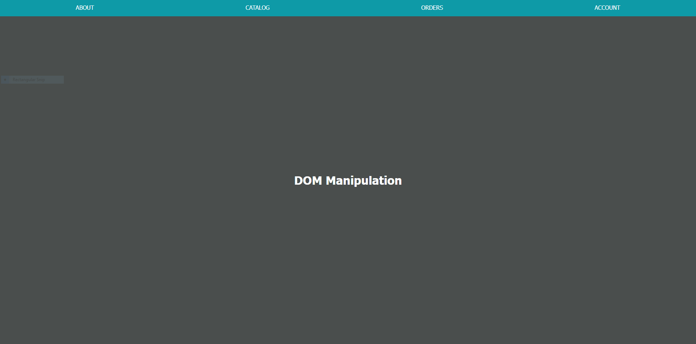
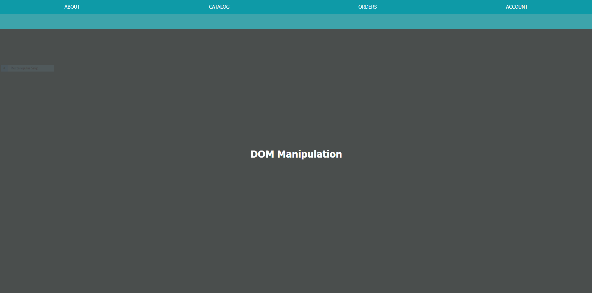
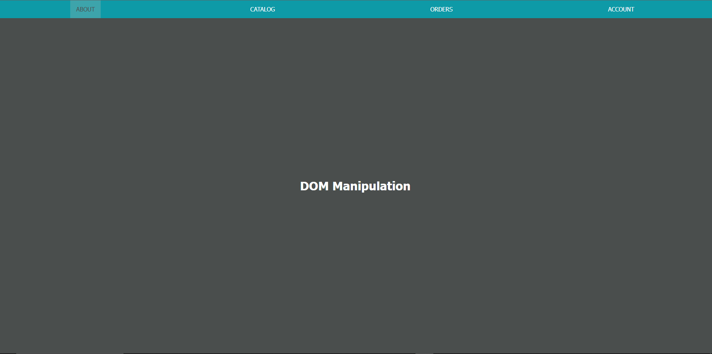
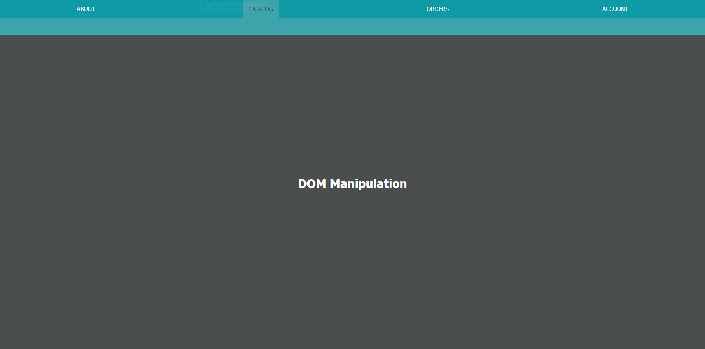
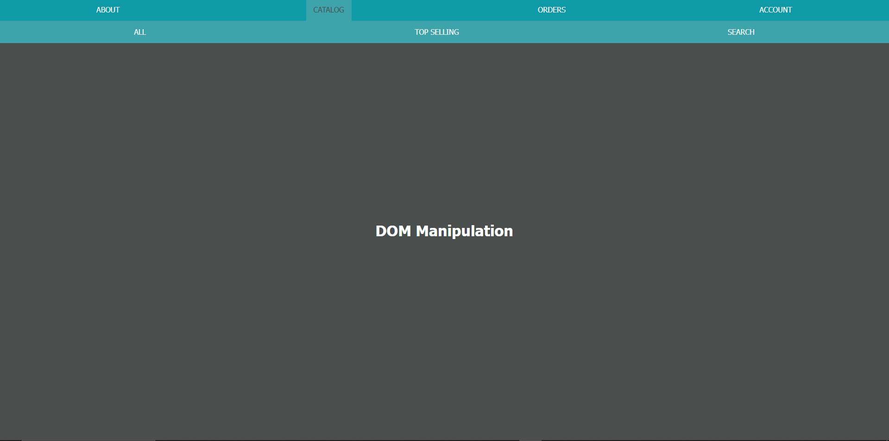
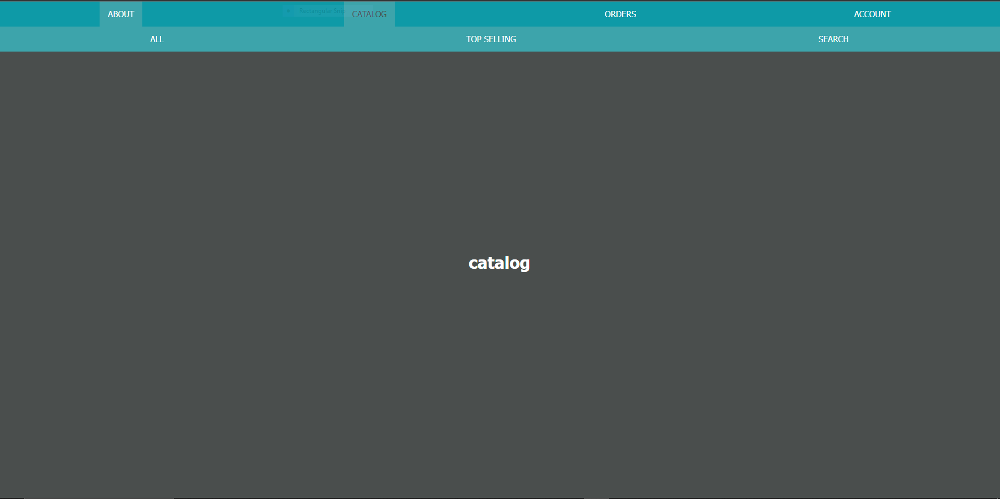

# R-ALAB 316.3.1

## DOM Manipulation Part Two

### Part One: Getting Started

- Take a few moments to explore your code and refamiliarize yourself with it. Now that you have a deeper understanding of DOM manipulation concepts, if there is anything you would like to fix or change, now is the time to do so.

- This is what your webpage should look like



### Part Two Adding Additional HTML and CSS

1. In order to facilitate this, add the following additional "sub-menu" nav element to the index.html file within your header element, beneath the existing nav element, as follows:
   ```html
   <header>
     <nav id="top-menu"></nav>
     <!-- Add the <nav> element below -->
     <nav id="sub-menu"></nav>
   </header>
   ```
   2.Secondly, add the following to the styles.css file:
   ```css
   header,
   #top-menu {
     position: relative;
   }
   #top-menu {
     z-index: 20;
   }
   #sub-menu {
     width: 100%;
     z-index: 10;
     transition: top 0.5s ease-out;
   }
   #sub-menu a:hover {
     background-color: var(--top-menu-bg);
   }
   nav a.active {
     background-color: var(--sub-menu-bg);
     color: var(--main-bg);
   }
   ```

> [!NOTE] This is a good time to commit

### Part Three Creating the Submenu

1. Select and cache the nav id="sub-menu" element in a variable named subMenuEl.
   - Use document.getElementByID
   ```javascript
   const subMenuEl = document.getElementById("sub-menu");
   ```
   -console logging subMenuEl should print:
   ```html
   <nav id="sub-menu"></nav>
   ```
2. Set the height subMenuEl element to be "100%".

   - Use Element.style.height to set the height to 100%

   ```javascript
   subMenuEl.style.height = "100%";
   ```

3. Set the background color of subMenuEl to the value stored in the --sub-menu-bg CSS custom property.

   - Use Element.style.background to set the elements background color

   ```javascript
   subMenuEl.style.background = "var(--sub-menu-bg)";
   ```

4. Add the class of flex-around to the subMenuEl element.
   - Use Element.classList.add to add a class to the element
   ```javascript
   subMenuEl.classList.add("flex-around");
   ```

- your webpage should look like ths

  

- Now, change the position of the submenu to temporarily hide it. Later, we will make the submenu appear dynamically based on user interaction:

1. Set the CSS position property of subMenuEl to the value of absolute.

   - Use Element.style.position to change its position to absolute.

   ```javascript
   subMenuEl.style.position = "absolute";
   ```

2. Set the CSS top property of subMenuEl to the value of 0.

   -Use Element.style.top to change the top value to 0

   ```javascript
   subMenuEl.style.top = "0";
   ```

- This is what your webpage should look like

  > [!NOTE] We hid the subMenu to render it conditionally when we click on a link.


> [!NOTE] Good Time to commit!

### Part Four Adding Menu Interaction

- In order to add submenu links, we will need to restructure the menuLinks array within index.js. Update the menuLinks array to the following:

```javascript
const menuLinks = [
  { text: "about", href: "/about" },
  {
    text: "catalog",
    href: "#",
    subLinks: [
      { text: "all", href: "/catalog/all" },
      { text: "top selling", href: "/catalog/top" },
      { text: "search", href: "/catalog/search" },
    ],
  },
  {
    text: "orders",
    href: "#",
    subLinks: [
      { text: "new", href: "/orders/new" },
      { text: "pending", href: "/orders/pending" },
      { text: "history", href: "/orders/history" },
    ],
  },
  {
    text: "account",
    href: "#",
    subLinks: [
      { text: "profile", href: "/account/profile" },
      { text: "sign out", href: "/account/signout" },
    ],
  },
];
```

1. Select and cache the all of the <a> elements inside of topMenuEl in a variable named topMenuLinks.

   - Use document.querySelectorAll to get a list of all a elements and store it

   ```javascript
   const topMenuLinks = document.querySelectorAll("a");
   ```

   - Console logging topMenuLinks returns a NodeList with 4 elements

   ```
   NodeList(4)
   0: a
   1: a
   2: a
   3: a
   ```

2. Attach a delegated 'click' event listener to topMenuEl.

   - Use Element.addEventListener

   ```javascript
   topMenuEl.addEventListener("click", (event) => {});
   ```

   - The first line of code of the event listener function should call the event object's preventDefault() method.

   ```javascript
   topMenuEl.addEventListener("click", (event) => {
     event.preventDefault();
   });
   ```

   - The second line of code of the function should immediately return if the element clicked was not an "a" element.

   - Use the event.target to checy if an a tag was clicked

   ```javascript
   topMenuEl.addEventListener("click", (event) => {
     event.preventDefault();
     if (event.target.tagName !== "A") {
       return;
     }
   });
   ```

   - Log the content of the <a> to verify the handler is working.

   ```javascript
   topMenuEl.addEventListener("click", (event) => {
     event.preventDefault();
     if (event.target.tagName !== "A") {
       return;
     } else {
       console.log(event.target);
     }
   });
   ```

   - You should only see a console log when you click on a link nowhere else

     -Ex. Click on account
     OutPut

   ```html
   <a href="#">account</a>
   ```

- Now that we have references to each of these links, and a registered event listener, we will want to add a toggled "active" state to each menu item, showing whether or not it is currently selected:

1. The event listener should add the active class to the "a" element that was clicked, unless it was already active, in which case it should remove it.

   - use Array.forEach to remove the "active" class for each link. Remove the class using Element.classList.remove

   ```javascript
   topMenuEl.addEventListener("click", (event) => {
     event.preventDefault();
     if (event.target.tagName !== "A") {
       return;
     } else {
       //console.log(event.target);
       topMenuLinks.forEach((a) => a.classList.remove("active"));
     }
   });
   ```

   - now "toggle" the acitve class on the clicked link
     using Element.classList.toggle

   ```javascript
   topMenuEl.addEventListener("click", (event) => {
     event.preventDefault();
     if (event.target.tagName !== "A") {
       return;
     } else {
       //console.log(event.target);
       topMenuLinks.forEach((a) => a.classList.remove("active"));
       event.target.classList.toggle("active");
     }
   });
   ```

- This is what your webpage should look like

  > [!NOTE] Only one link should be highlighted at a time

  

  > [!NOTE] Good Time to commit!

### Part Five: Adding Submenu Interaction

Task: Within the same event listener, we want to toggle the submenu between active and non-active states. First, we will set the submenu to show or hide itself depending on the menu state:

1.  Within the event listener, if the clicked "a" element does not yet have a class of "active" (it was inactive when clicked):

        a. If the clicked "a" element's "link" object within menuLinks has a subLinks property (all do, except for the "link" object for ABOUT), set the CSS top property of subMenuEl to 100%.

        - Check if the clicked link has an "active" class. Using Element.classList.contains.

        ```javascript
        topMenuEl.addEventListener("click", (event) => {
          event.preventDefault();
          if (event.target.tagName !== "A") {
            return;
          } else {
            //console.log(event.target);
            topMenuLinks.forEach((a) => a.classList.remove("active"));
            event.target.classList.toggle("active");

            if (event.target.classList.contains("active")) {
            }
          }
        });
        ```

        b. Otherwise, set the CSS top property of subMenuEl to 0.

        - Hint: Caching the "link" object will come in handy for passing its subLinks array later.

        - Store the current clicked link in avariable

        ```javascript
        topMenuEl.addEventListener("click", (event) => {
          event.preventDefault();
          if (event.target.tagName !== "A") {
            return;
          } else {
            //console.log(event.target);
            topMenuLinks.forEach((a) => a.classList.remove("active"));
            event.target.classList.toggle("active");

            if (event.target.classList.contains("active")) {
              const currentLink = event.target.innerHTML;
            }
          }
        });
        ```

        - Now we are going to loop through the menuLinks

        ```javascript
        topMenuEl.addEventListener("click", (event) => {
          event.preventDefault();
          if (event.target.tagName !== "A") {
            return;
          } else {
            //console.log(event.target);
            topMenuLinks.forEach((a) => a.classList.remove("active"));
            event.target.classList.toggle("active");

            if (event.target.classList.contains("active")) {
              const currentLink = event.target.innerHTML;
              menuLinks.forEach((link) => {});
            }
          }
        });
        ```

        - Check if the current link exists in the topMenuLinks array

        ```javascript
        topMenuEl.addEventListener("click", (event) => {
          event.preventDefault();
          if (event.target.tagName !== "A") {
            return;
          } else {
            //console.log(event.target);
            topMenuLinks.forEach((a) => a.classList.remove("active"));
            event.target.classList.toggle("active");

            if (event.target.classList.contains("active")) {
              const currentLink = event.target.innerHTML;
              menuLinks.forEach((link) => {
                if (link.text === currentLink) {
                }
              });
            }
          }
        });
        ```

        -check if the link has a subLinks property

        ```javascript
        topMenuEl.addEventListener("click", (event) => {
          event.preventDefault();
          if (event.target.tagName !== "A") {
            return;
          } else {
            //console.log(event.target);
            topMenuLinks.forEach((a) => a.classList.remove("active"));
            event.target.classList.toggle("active");

            if (event.target.classList.contains("active")) {
              const currentLink = event.target.innerHTML;
              menuLinks.forEach((link) => {
                if (link.text === currentLink) {
                  if (link.hasOwnProperty("subLinks")) {
                  }
                }
              });
            }
          }
        });
        ```

        - if subLinks exists set subMEnuEl to 100%

        ```javascript
        topMenuEl.addEventListener("click", (event) => {
          event.preventDefault();
          if (event.target.tagName !== "A") {
            return;
          } else {
            //console.log(event.target);
            topMenuLinks.forEach((a) => a.classList.remove("active"));
            event.target.classList.toggle("active");

            if (event.target.classList.contains("active")) {
              const currentLink = event.target.innerHTML;
              menuLinks.forEach((link) => {
                if (link.text === currentLink) {
                  if (link.hasOwnProperty("subLinks")) {
                    subMenuEl.style.top = "100%";
                  }
                }
              });
            }
          }
        });
        ```

        - else set submenu to 0

        ```javascript
        topMenuEl.addEventListener("click", (event) => {
          event.preventDefault();
          if (event.target.tagName !== "A") {
            return;
          } else {
            //console.log(event.target);
            topMenuLinks.forEach((a) => a.classList.remove("active"));
            event.target.classList.toggle("active");

            if (event.target.classList.contains("active")) {
              const currentLink = event.target.innerHTML;
              menuLinks.forEach((link) => {
                if (link.text === currentLink) {
                  if (link.hasOwnProperty("subLinks")) {
                    subMenuEl.style.top = "100%";
                  } else {
                    subMenuEl.style.top = "0";
                  }
                }
              });
            }
          }
        });
        ```

- This is what your webpage should look like



> [!NOTE] Good Time to commit!

Task: The submenu needs to be dynamic based on the clicked link. To facilitate that, we will create a helper function called buildSubmenu that does the following:

```javascript
function buildSubMenuEl(array) {}
```

1. Clear the current contents of subMenuEl.
   - Use Element.innerHTML to clear the current content

```javascript
function buildSubMenuEl(array) {
  subMenuEl.innerHTML = "";
}
```

2. Iterate over the subLinks array, passed as an argument, and for each "link" object:

- Use Array.forEach to iterate through the array

```javascript
function buildSubMenuEl(array) {
  subMenuEl.innerHTML = "";
  array.forEach((link) => {});
}
```

a. Create an <a> element.

- Use document.createElement

```javascript
function buildSubMenuEl(array) {
  subMenuEl.innerHTML = "";
  array.forEach((link) => {
    let aEl = document.createElement("a");
  });
}
```

b. Add an href attribute to the "a", with the value set by the href property of the "link" object.

- use Element.setAttribute

```javascript
function buildSubMenuEl(array) {
  subMenuEl.innerHTML = "";
  array.forEach((link) => {
    let aEl = document.createElement("a");
    aEl.setAttribute("href", link.href);
  });
}
```

c. Set the element's content to the value of the text property of the "link" object. - Use Element.innerHTML, Node.textContent or Element.innerText to set the Link name

```javascript
function buildSubMenuEl(array) {
  subMenuEl.innerHTML = "";
  array.forEach((link) => {
    let aEl = document.createElement("a");
    aEl.setAttribute("href", link.href);
    aEl.innerHTML = link.text;
  });
}
```

d. Append the new element to the subMenuEl.

    - Use Element.append to add the links to the submenu

```javascript
function buildSubMenuEl(array) {
  subMenuEl.innerHTML = "";
  array.forEach((link) => {
    let aEl = document.createElement("a");
    aEl.setAttribute("href", link.href);
    aEl.innerHTML = link.text;
    subMenuEl.append(aEl);
  });
}
```

- Once you have created your helper function, include it in the event listener within the same logic that shows the submenu, remembering to pass the array of sub-links as an argument.

  ```javascript
  topMenuEl.addEventListener("click", (event) => {
    event.preventDefault();
    if (event.target.tagName !== "A") {
      return;
    } else {
      //console.log(event.target);
      topMenuLinks.forEach((a) => a.classList.remove("active"));
      event.target.classList.toggle("active");

      if (event.target.classList.contains("active")) {
        const currentLink = event.target.innerHTML;
        menuLinks.forEach((link) => {
          if (link.text === currentLink) {
            if (link.hasOwnProperty("subLinks")) {
              subMenuEl.style.top = "100%";
              buildSubMenu(link.subLinks);
            } else {
              subMenuEl.style.top = "0";
            }
          }
        });
      }
    }
  });
  ```

- This is what your webpage should look like



> [!NOTE] Good Time to commit!

- Task: The menu is almost complete! Now, we need to add interactions to the submenu items themselves:

1. Attach a delegated 'click' event listener to subMenuEl.

```javascript
subMenuEl.addEventListener("click", (event) => {});
```

- The first line of code of the event listener function should call the event object's preventDefault() method.

```javascript
subMenuEl.addEventListener("click", (event) => {
  event.preventDefault();
});
```

- The second line of code within the function should immediately return if the element clicked was not an "a" element.

  - We can use the Element matches to check if it is an a tag

```javascript
subMenuEl.addEventListener("click", (event) => {
  event.preventDefault();
  if (!event.target.matches("a")) {
    return;
  }
});
```

- Log the content of the <a> to verify the handler is working.

```javascript
subMenuEl.addEventListener("click", (event) => {
  event.preventDefault();
  if (!event.target.matches("a")) {
    return;
  } else {
    console.log(event.target);
  }
});
```

- Ex. Click on All under catalog it should console log:

```html
<a href="/catalog/all">all<></a>
```

2. Next, the event listener should set the CSS top property of subMenuEl to 0.

- Use the Element.style.top to achieve this

```javascript
subMenuEl.addEventListener("click", (event) => {
  event.preventDefault();
  if (!event.target.matches("a")) {
    return;
  } else {
    // console.log(event.target);
    subMenuEl.style.top = "0";
  }
});
```

3. Remove the active class from each a element in topMenuLinks.

- Use the Array.foreach mehtod combined with the Element.classList.remove

```javascript
subMenuEl.addEventListener("click", (event) => {
  event.preventDefault();
  if (!event.target.matches("a")) {
    return;
  } else {
    // console.log(event.target);
    subMenuEl.style.top = "0";
    topMenuLinks.forEach((link) => link.classList.remove("active"));
  }
});
```

4. Update the contents of mainEl, within an "h1", to the contents of the "a" element clicked within subMenuEl.

   - use Element.innerHTML to insert the h1 and text

   ```javascript
   subMenuEl.addEventListener("click", (event) => {
     event.preventDefault();
     if (!event.target.matches("a")) {
       return;
     } else {
       // console.log(event.target);
       subMenuEl.style.top = "0";
       topMenuLinks.forEach((link) => link.classList.remove("active"));
       mainEl.innerHTML = `<h1>${event.target.innerHTML}</h1>`;
     }
   });
   ```

5. If the ABOUT link is clicked, an "h1" About should be displayed.

- go back to your topMenuEl event listener and use Element.innerHTML to insert the h1 and text

```javascript
topMenuEl.addEventListener("click", (event) => {
  event.preventDefault();
  if (event.target.tagName !== "A") {
    return;
  } else {
    topMenuLinks.forEach((a) => a.classList.remove("active"));
    //This was added v
    mainEl.innerHTML = `<h1>${event.target.textContent}</h1>`;
    console.dir(event.target);
    event.target.classList.toggle("active");

    if (event.target.classList.contains("active")) {
      const currentLink = event.target.innerHTML;
      menuLinks.forEach((link) => {
        if (link.text === currentLink) {
          if (link.hasOwnProperty("subLinks")) {
            subMenuEl.style.top = "100%";
            buildSubmenu(link.subLinks);
          } else {
            subMenuEl.style.top = "0";
          }
        }
      });
    }
  }
});
```

- This is what your webpage should look like

  

  > [!NOTE] Good Time to commit!
